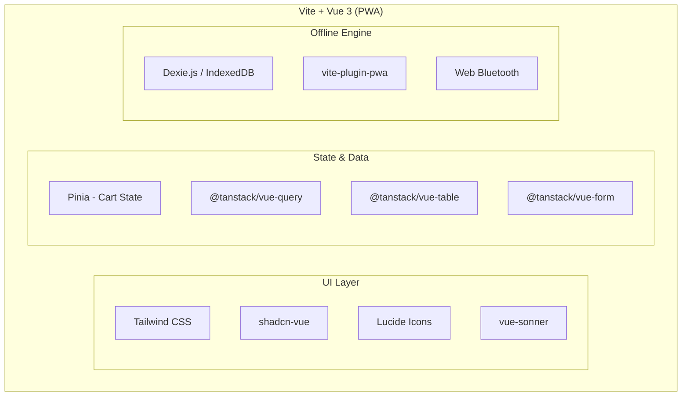
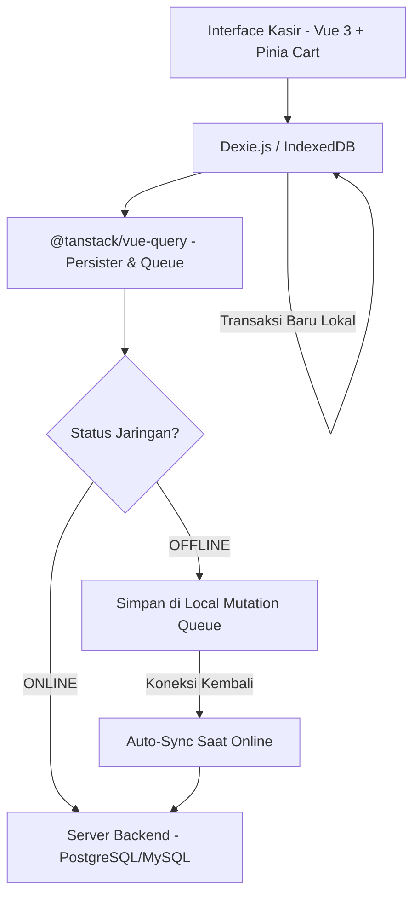
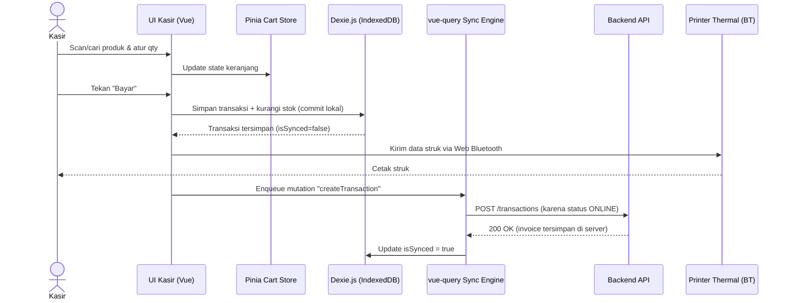
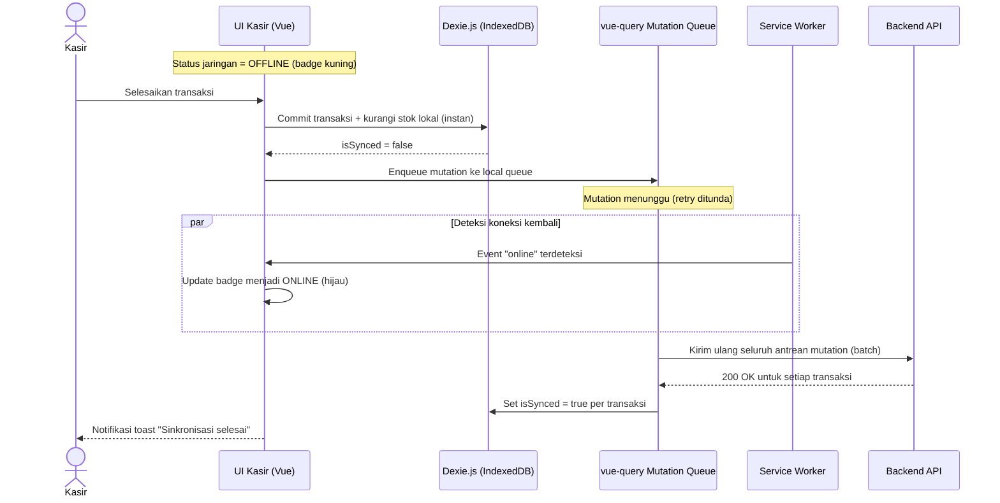
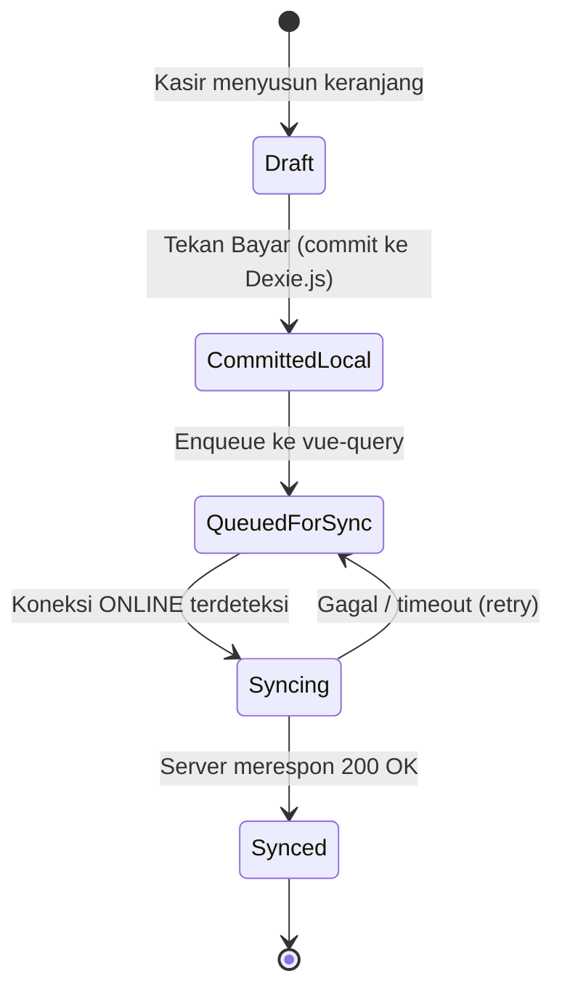
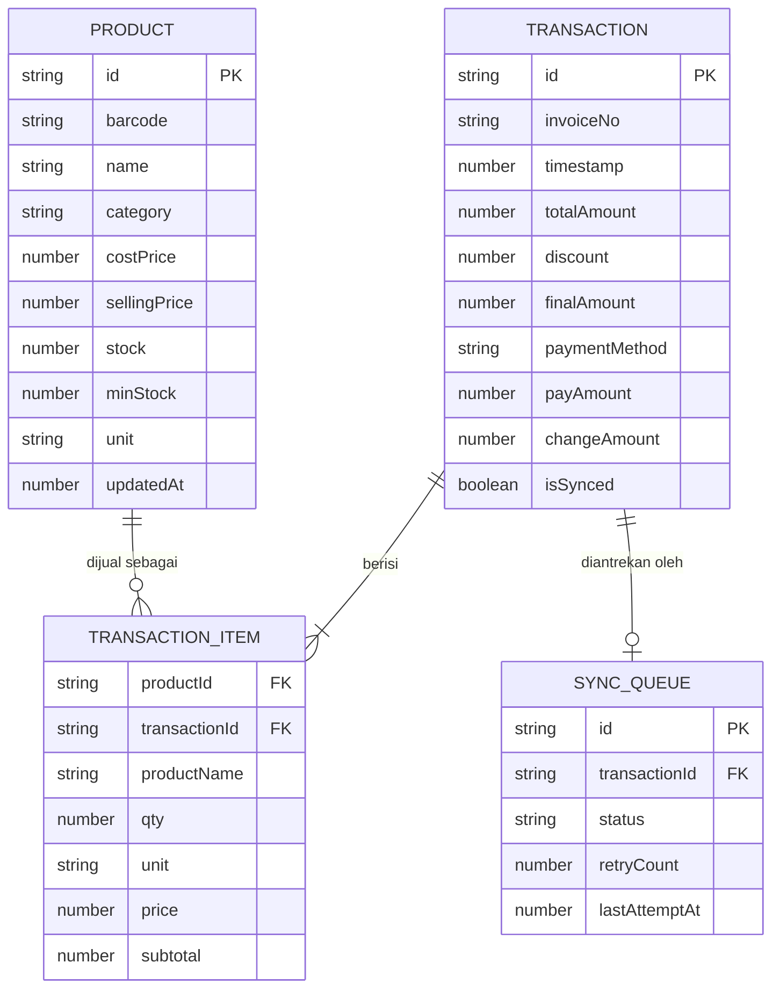

# Product Requirements Document (PRD)

# **Point of Sale (PWA) — Offline-First Point of Sale**

---

## 0. Document Control

| Parameter            | Detail                                                            |
| :------------------- | :---------------------------------------------------------------- |
| **Product Name**     | Point of Sale                                                     |
| **Platform Target**  | Progressive Web App (PWA) — Mobile (Android/iOS), Tablet, Desktop |
| **Architecture**     | Offline-First (100% Operasional Tanpa Internet)                   |
| **Frontend Stack**   | Vue 3 + Vite + Pinia + Vue Router                                 |
| **UI System**        | Tailwind CSS + **shadcn-vue** + Lucide Icons                      |
| **Data & Offline**   | `@tanstack/vue-query` + Dexie.js (IndexedDB)                      |
| **Form & Table**     | `@tanstack/vue-form` + `@tanstack/vue-table`                      |
| **Document Version** | 2.4.0                                                             |
| **Status**           | Approved / Aligned with Codebase                                  |
| **Tanggal Revisi**   | 05 Agustus 2026                                                   |

### 0.1 Riwayat Dokumen

| Versi | Tanggal         | Perubahan                                                                                                                                                        | Penulis      |
| :---- | :-------------- | :--------------------------------------------------------------------------------------------------------------------------------------------------------------- | :----------- |
| 1.0.0 | -               | Draft awal: scope, tech stack, wireframe konsep                                                                                                                  | Product Team |
| 2.0.0 | 02 Agustus 2026 | Penambahan Problem Statement, Goals & KPI, User Stories, Sequence/ERD/State Diagram (Mermaid), Risiko, RACI, Acceptance Criteria, Glossary                       | Product Team |
| 2.1.0 | 02 Agustus 2026 | Penambahan Backend Technology Stack (NestJS + Prisma + PostgreSQL) & struktur Repository Monolith (Monorepo pnpm workspaces)                                     | Product Team |
| 2.2.0 | 02 Agustus 2026 | Penyesuaian backend: framework diganti dari NestJS ke Express.js, autentikasi menggunakan Supabase Auth (email/password & Bearer JWT)                            | Product Team |
| 2.3.0 | 02 Agustus 2026 | Pemisahan eksplisit cakupan rilis V1 (MVP) vs V2 di seluruh dokumen: Functional Requirements, Backend Stack, Out-of-Scope, Roadmap, Dependencies, Open Questions | Product Team |
| 2.4.0 | 05 Agustus 2026 | Sinkronisasi penuh dokumen PRD dengan implementasi riil: penamaan `@point-of-sale/*`, pembagian layer backend `controllers/` + `routes/`, pembaruan Dexie v2, PWA Install Banner, TanStack Vue Form & Table, dan kompresi foto. | Product Team |

### 0.2 Stakeholders & RACI

| Peran                                 | Nama/Tim | R (Responsible) | A (Accountable) | C (Consulted) | I (Informed) |
| :------------------------------------ | :------- | :-------------- | :-------------- | :------------ | :----------- |
| Product Owner                         | TBD      | ✔               | ✔               |               |              |
| Tech Lead / Architect                 | TBD      | ✔               |                 | ✔             |              |
| Frontend Engineer (Vue)               | TBD      | ✔               |                 |               | ✔            |
| Backend Engineer                      | TBD      | ✔               |                 |               | ✔            |
| UI/UX Designer                        | TBD      | ✔               |                 | ✔             |              |
| QA Engineer                           | TBD      | ✔               |                 |               | ✔            |
| Pemilik Warung (End User/Beta Tester) | TBD      |                 |                 | ✔             | ✔            |

---

## 1. Executive Summary & Vision

**Point of Sale** adalah aplikasi kasir Point of Sale (POS) berbasis **Progressive Web App (PWA)** dengan pendekatan **Offline-First**, dirancang khusus untuk memenuhi kebutuhan operasional warung sembako skala kecil hingga menengah.

Warung sembako memiliki karakteristik transaksi yang sangat cepat, volume barang tinggi, satuan unit eceran/desimal (seperti `0.25 kg` atau `1.5 liter`), serta risiko gangguan koneksi internet yang tinggi. Aplikasi ini menjamin bahwa seluruh aktivitas kasir, pencarian barang, pengurangan stok, hingga pencetakan struk belanja dapat berjalan **100% tanpa jaringan internet**, dan secara otomatis melakukan sinkronisasi (_background sync_) ketika koneksi internet kembali tersedia.

---

## 2. Problem Statement (Latar Belakang Masalah)

Warung sembako di area perumahan maupun pasar tradisional umumnya masih mencatat transaksi secara manual (buku/nota) atau menggunakan aplikasi kasir yang **mengharuskan koneksi internet stabil**. Hal ini menimbulkan masalah nyata:

1. **Ketergantungan Internet** — Banyak aplikasi kasir berbasis cloud gagal total (freeze/crash) ketika sinyal seluler hilang, padahal transaksi warung tidak boleh berhenti.
2. **Satuan Non-Integer** — Sebagian besar aplikasi kasir off-the-shelf hanya mendukung kuantitas bulat (pcs), padahal komoditas sembako dijual eceran (kg, gram, liter).
3. **Perangkat Terbatas** — Pemilik warung umumnya menggunakan HP Android kelas entry-level; aplikasi native yang berat sering tidak kompatibel atau memakan storage besar.
4. **Kehilangan Data Transaksi** — Saat koneksi terputus di tengah transaksi, banyak sistem kehilangan data penjualan karena belum tersimpan lokal.
5. **Rekonsiliasi Manual** — Pemilik toko kesulitan memantau stok real-time dan sering kehabisan barang tanpa peringatan dini.

**Point of Sale** menjawab masalah ini dengan arsitektur _local-first_: seluruh operasi kasir berjalan penuh di perangkat (IndexedDB) tanpa bergantung pada respons server, dan sinkronisasi terjadi secara transparan di latar belakang.

---

## 3. Goals & Objectives

### 3.1 Business Goals

- Menyediakan solusi kasir digital berbiaya rendah (tanpa hardware POS khusus) untuk warung sembako.
- Meningkatkan akurasi pencatatan stok dan penjualan dibanding pencatatan manual.
- Mempercepat proses checkout untuk mengurangi antrean pelanggan di jam ramai.
- Membangun basis data transaksi yang dapat dianalisis untuk fitur lanjutan (laporan penjualan, rekomendasi restock) di fase berikutnya.

### 3.2 Success Metrics / KPI

| Metrik                                    | Target                                                                    | Cara Ukur                            |
| :---------------------------------------- | :------------------------------------------------------------------------ | :----------------------------------- |
| Waktu checkout per transaksi              | < 3 detik (dari tambah item terakhir → struk tercetak)                    | Instrumentasi event frontend         |
| Latency pencarian produk                  | < 50ms untuk 5.000+ SKU                                                   | Profiling query Dexie.js             |
| Time-to-Interactive (TTI)                 | < 1.5 detik                                                               | Lighthouse PWA Audit                 |
| Tingkat keberhasilan sync otomatis        | ≥ 99% transaksi offline tersinkron dalam < 5 menit setelah online kembali | Log status `isSynced` di backend     |
| Crash/error rate saat offline             | 0 kegagalan pencatatan transaksi lokal                                    | QA regression test / crash reporting |
| Adopsi instalasi PWA (Add to Home Screen) | ≥ 80% pengguna aktif dalam 30 hari pertama                                | Analytics PWA install event          |

### 3.3 Cakupan Rilis: V1 (MVP) vs V2

Agar tidak ada kebingungan saat eksekusi, setiap fitur/komponen di dokumen ini ditandai dengan label rilis. **Prinsip pembagian:** V1 mencakup semua hal yang wajib ada agar warung bisa berjualan harian secara offline-first tanpa hambatan (nilai inti produk). V2 mencakup penyempurnaan, skalabilitas, dan fitur pendukung yang **tidak menghalangi go-live** V1.

| Label               | Arti                                                             |
| :------------------ | :--------------------------------------------------------------- |
| 🟢 **V1**           | Wajib selesai sebelum go-live / rilis pertama (MVP)              |
| 🔵 **V2**           | Direncanakan untuk rilis berikutnya, bukan blocker MVP           |
| ⚫ **Out-of-Scope** | Di-hold permanen, tidak direncanakan di roadmap manapun saat ini |

#### Ringkasan Cakupan per Kategori

| Kategori       | Fitur/Komponen                                                                                                      | Rilis           |
| :------------- | :------------------------------------------------------------------------------------------------------------------ | :-------------- |
| Kasir Core     | Pencarian produk, kuantitas desimal, keranjang                                                                      | 🟢 V1           |
| Kasir Core     | Pembayaran Tunai + preset nominal cepat                                                                             | 🟢 V1           |
| Kasir Core     | Pembayaran QRIS (saat online) **di-hold → V2**                                                                      | 🔵 V2           |
| Kasir Core     | Cetak struk thermal via Web Bluetooth                                                                               | 🟢 V1           |
| Kasir Core     | Fallback cetak struk (PDF/digital) untuk perangkat tanpa Web Bluetooth                                              | 🔵 V2           |
| Inventaris     | Katalog produk (CRUD), peringatan stok rendah, stock opname                                                         | 🟢 V1           |
| Inventaris     | Import/export katalog massal (CSV)                                                                                  | 🔵 V2           |
| Offline Engine | Zero-latency local commit, status indicator, mutation queue, auto background sync                                   | 🟢 V1           |
| Backend        | Auth dasar (Supabase Auth email/password & JWT verifikasi backend), endpoint products, transactions/sync, inventory | 🟢 V1           |
| Backend        | Redis + BullMQ (job queue async untuk batch sync besar)                                                             | 🔵 V2           |
| Backend        | Social login / multi-provider auth via Supabase Auth                                                                | 🔵 V2           |
| Akses & Peran  | Satu sesi login per perangkat (tanpa role granular)                                                                 | 🟢 V1           |
| Akses & Peran  | Multi-role granular (Admin vs Kasir dengan permission berbeda)                                                      | 🔵 V2           |
| Skala Toko     | Single-outlet                                                                                                       | 🟢 V1           |
| Skala Toko     | Multi-cabang / multi-outlet                                                                                         | 🔵 V2           |
| Laporan        | Riwayat transaksi (list + status sync)                                                                              | 🟢 V1           |
| Laporan        | Dashboard laporan penjualan (harian/bulanan/grafik)                                                                 | 🔵 V2           |
| Supply Chain   | Manajemen supplier & purchase order otomatis                                                                        | 🔵 V2           |
| Integrasi      | Integrasi akuntansi pihak ketiga (Accurate, Jurnal, dsb.)                                                           | 🔵 V2           |
| Pembayaran     | Fitur Kasbon / Utang Pelanggan                                                                                      | ⚫ Out-of-Scope |

> Detail per-requirement (dengan ID FR) tetap dilabeli ulang di masing-masing section (Functional Requirements, Backend Stack, Roadmap) agar tim development bisa langsung merujuk tanpa perlu bolak-balik ke tabel ringkasan ini.

---

## 4. Target Pengguna (Target Audience & Personas)

### Primary Persona: Pemilik & Kasir Warung Sembako

- **Profil:** Pemilik toko atau staf kasir yang membutuhkan antarmuka simpel, kontras tinggi, dan responsif.
- **Kebutuhan Utama:**
  - Proses checkout super cepat (< 3 detik per transaksi).
  - Pencarian barang instan (ketik nama atau scan barcode).
  - Penjualan eceran berbasis timbangan/desimal (misal: `0.5 kg` gula pasir).
  - Dapat diakses dari HP Android murah, Tablet, maupun Laptop.
  - Tetap bekerja lancar saat jaringan seluler atau WiFi mati/labil.

### 4.1 User Stories

| ID      | Sebagai...   | Saya ingin...                                                        | Agar...                                         |
| :------ | :----------- | :------------------------------------------------------------------- | :---------------------------------------------- |
| US-01   | Kasir        | mencari produk hanya dengan mengetik sebagian nama atau scan barcode | transaksi bisa diproses dengan cepat            |
| US-02   | Kasir        | memasukkan kuantitas desimal (mis. 0.25 kg)                          | bisa melayani penjualan eceran/timbangan        |
| US-03   | Kasir        | tetap bisa menyelesaikan transaksi saat WiFi/data mati               | pelanggan tidak perlu menunggu atau ditolak     |
| US-04   | Kasir        | melihat indikator status online/offline di layar                     | tahu kondisi jaringan tanpa harus mengecek HP   |
| US-05   | Kasir        | mencetak struk via printer Bluetooth thermal                         | pelanggan mendapat bukti belanja fisik          |
| Pemilik | Pemilik Toko | mendapat notifikasi stok menipis                                     | bisa restock sebelum kehabisan barang           |
| US-07   | Pemilik Toko | melihat riwayat transaksi yang sudah/belum tersinkron ke server      | memastikan tidak ada data penjualan yang hilang |
| US-08   | Pemilik Toko | melakukan stock opname cepat                                         | data stok sistem sesuai stok fisik di rak       |

---

## 5. Technology Stack & Ecosystem

Kombinasi teknologi dipilih berdasarkan performa, keandalan offline, serta kebebasan kustomisasi UI.

| Komponen                       | Teknologi                  | Peran & Alasan Pemilihan                                                                                                                         |
| :----------------------------- | :------------------------- | :----------------------------------------------------------------------------------------------------------------------------------------------- |
| **Framework & Build Tool**     | **Vue 3 + Vite**           | Composition API (`<script setup>`) memberikan performa sangat tinggi, _footprint_ memori kecil, serta integrasi PWA cepat via `vite-plugin-pwa`. |
| **UI Component Library**       | **shadcn-vue** _(Reka UI)_ | Menyediakan komponen unstyled/accessible primitive yang disalin langsung ke codebase. Sangat fleksibel dikustomisasi menggunakan Tailwind CSS.   |
| **Styling Core**               | **Tailwind CSS v3 / v4**   | Memudahkan styling antarmuka responsif (Mobile vs Desktop) dan memperbesar _touch target_ untuk layar sentuh HP.                                 |
| **Offline Storage (Local DB)** | **Dexie.js (IndexedDB)**   | Wrapper IndexedDB di browser untuk menyimpan puluhan ribu produk, riwayat transaksi, dan antrean sync secara instan & persistent.                |
| **Data Query & Sync Engine**   | **`@tanstack/vue-query`**  | Menangani caching, mutation queue saat offline, dan pembaruan background sync otomatis ketika koneksi kembali _online_.                          |
| **Shopping Cart State**        | **Pinia**                  | State management resmi Vue 3 untuk mengelola keranjang belanja secara _reactive_ dan real-time.                                                  |
| **Form Management**            | **`@tanstack/vue-form`**   | Menangani input produk, stok opname, dan validasi dengan aman tanpa _unnecessary re-renders_.                                                    |
| **Data Tables**                | **`@tanstack/vue-table`**  | Rendering daftar inventaris barang yang besar dan riwayat transaksi dengan sorting/filtering super cepat.                                        |
| **Hardware Driver**            | **Web Bluetooth API**      | Koneksi langsung dari browser PWA ke printer thermal Bluetooth tanpa aplikasi perantara.                                                         |



### 5.1 Backend Technology Stack _(Diusulkan)_

Backend sebelumnya hanya disebut secara konseptual ("Server Backend — PostgreSQL/MySQL"). Berikut stack konkret yang diusulkan, dipilih agar selaras dengan ekosistem TypeScript di frontend (type-safety end-to-end) dan cukup sederhana untuk kebutuhan sync-only backend (bukan sistem transaksional real-time yang kompleks).

| Komponen                    | Teknologi                                                                                      | Peran & Alasan Pemilihan                                                                                                                                                                                                                                                                                                                                  |
| :-------------------------- | :--------------------------------------------------------------------------------------------- | :-------------------------------------------------------------------------------------------------------------------------------------------------------------------------------------------------------------------------------------------------------------------------------------------------------------------------------------------------------- |
| **Runtime** 🟢 V1           | **Node.js (LTS 20+)**                                                                          | Selaras dengan ekosistem JS/TS di frontend, memudahkan sharing tipe data (DTO) antara FE & BE.                                                                                                                                                                                                                                                            |
| **Framework API** 🟢 V1     | **Express.js (TypeScript)**                                                                    | Framework minimal & fleksibel, cukup ringan untuk backend yang fungsi utamanya sebagai sync endpoint + CRUD produk/inventaris, tanpa overhead struktur besar.                                                                                                                                                                                             |
| **ORM & Migration** 🟢 V1   | **Prisma ORM**                                                                                 | Type-safe query builder, auto-generate TypeScript types dari schema, migration terkelola dengan baik untuk PostgreSQL.                                                                                                                                                                                                                                    |
| **Database Utama** 🟢 V1    | **PostgreSQL 15+**                                                                             | Mendukung tipe data numerik presisi tinggi (cocok untuk kuantitas desimal & uang), transaksi ACID untuk batch sync, dan skala data jangka panjang.                                                                                                                                                                                                        |
| **Autentikasi** 🟢 V1       | **Supabase Auth** (email + password & Bearer JWT)                                              | Menggunakan Supabase Auth SDK di frontend dan verifikasi Bearer JWT di backend middleware. Di V1 cukup pakai email-password; **social login & multi-provider ditunda ke V2**.                                                                                                                                                                             |
| **Validasi Request** 🟢 V1  | **Zod**                                                                                        | Validasi payload sync (mis. mencegah data transaksi korup/duplikat) sebelum masuk ke database; skema dapat di-share ke `packages/shared` untuk dipakai ulang di frontend.                                                                                                                                                                                 |
| **Job Antrean/Retry** 🔵 V2 | **BullMQ (Redis)**                                                                             | Menangani batch sync besar secara asynchronous & retry otomatis jika sebagian item gagal. **Tidak dipakai di V1** — di V1, endpoint sync diproses synchronous langsung di Express + PostgreSQL transaction, karena volume transaksi warung skala kecil belum memerlukan queue terpisah. Ditambahkan di V2 jika volume/latensi sync menjadi masalah nyata. |
| **API Style**               | **REST (JSON)**, versioned `/api/v1/...`                                                       | Sederhana, mudah di-debug, cukup untuk pola sync batch berkala (bukan real-time streaming).                                                                                                                                                                                                                                                               |
| **Dokumentasi API**         | **Swagger / OpenAPI** (`swagger-jsdoc` + `swagger-ui-express`)                                 | Auto-generate dokumentasi endpoint sync & inventory untuk memudahkan integrasi FE-BE.                                                                                                                                                                                                                                                                     |
| **Deployment**              | **Docker container**, hosting VPS/Cloud (mis. Railway, Fly.io, atau VPS + Nginx reverse proxy) | Portable, mudah dikelola tim kecil tanpa overhead infrastruktur besar.                                                                                                                                                                                                                                                                                    |

> Catatan: Jika tim lebih familiar dengan stack lain (mis. Laravel/PHP, Express minimal, atau Golang), pemilihan di atas dapat disesuaikan — prinsip intinya tetap: REST API stateless + PostgreSQL + validasi ketat pada endpoint sync.

#### 5.1.1 Endpoint Sync Utama (Ringkasan Kontrak API)

| Method | Endpoint                                      | Fungsi                                                                                                |
| :----- | :-------------------------------------------- | :---------------------------------------------------------------------------------------------------- |
| `POST` | `/api/v1/auth/login` (atau Supabase Auth SDK) | Autentikasi kasir/pemilik toko, mengembalikan session & JWT Bearer token                              |
| `POST` | `/api/v1/auth/logout`                         | Mengakhiri sesi login                                                                                 |
| `GET`  | `/api/v1/auth/session`                        | Mengambil status sesi aktif (dipakai FE untuk cek apakah kasir masih login saat reconnect)            |
| `GET`  | `/api/v1/products`                            | Mengambil katalog produk terbaru (untuk seeding/refresh data lokal Dexie.js)                          |
| `POST` | `/api/v1/transactions/sync`                   | Menerima batch transaksi dari mutation queue (idempotent berdasarkan `id` UUID lokal)                 |
| `GET`  | `/api/v1/transactions/sync-status?ids=...`    | Mengecek status sync sekumpulan transaksi (untuk rekonsiliasi jika koneksi terputus di tengah proses) |
| `POST` | `/api/v1/inventory/adjustments`               | Mengirim hasil stock opname ke server pusat                                                           |
| `GET`  | `/api/v1/inventory/low-stock`                 | Mengambil daftar produk dengan stok di bawah ambang batas (untuk notifikasi pemilik toko)             |

> Catatan: Autentikasi ditangani via Supabase Auth Client SDK di frontend dan Bearer JWT `authGuard` middleware di backend.

### 5.2 Repository Structure — Monolith Repo (Monorepo)

FE dan BE tetap **terpisah secara arsitektur** (lihat pembahasan sebelumnya), namun disatukan dalam **satu repository (monorepo/monolith repo)** agar memudahkan versioning bersama, sharing tipe data, dan deployment yang sinkron antar rilis. Dikelola menggunakan **pnpm workspaces**.

```
point-of-sale/
├── apps/
│   ├── frontend/                  # Vue 3 + Vite PWA (Client)
│   │   ├── src/
│   │   │   ├── components/        # UI components (ui, layout, pwa)
│   │   │   ├── views/             # Halaman: Kasir, Inventaris, Laporan, Opname, Sync, Ai, Login
│   │   │   ├── stores/            # Pinia stores (cart, sync, storeSettings, auth)
│   │   │   ├── composables/       # useInventory, usePwaInstall, useBluetoothPrinter
│   │   │   ├── services/          # api client, transactions, supabase
│   │   │   ├── db/                # Dexie.js schema & seed
│   │   │   └── router/
│   │   ├── public/
│   │   ├── vite.config.ts         # + vite-plugin-pwa config
│   │   └── package.json           # @point-of-sale/frontend
│   │
│   └── backend/                   # Express.js API (Server)
│       ├── src/
│       │   ├── routes/            # HTTP routes (products, transactions, inventory)
│       │   ├── controllers/       # Controller handlers (products, transactions, inventory)
│       │   ├── middleware/        # auth guard (Supabase JWT), store-access, validate
│       │   ├── lib/               # storage, errors
│       │   ├── db.ts              # Prisma instance
│       │   └── server.ts          # Express entrypoint
│       ├── prisma/
│       │   ├── schema.prisma
│       │   ├── seed.ts
│       │   └── migrations/
│       └── package.json           # @point-of-sale/backend
│
├── packages/
│   └── shared/                    # Shared types & Zod schemas FE <-> BE
│       ├── src/
│       │   ├── types/             # Product, Transaction, TransactionItem, dll.
│       │   └── schemas/           # Zod schemas (productSyncSchema, syncPayloadSchema, dll.)
│       └── package.json           # @point-of-sale/shared
│
├── .gitignore
├── pnpm-workspace.yaml
└── package.json                   # root workspace (point-of-sale)
```

**Alasan pendekatan monorepo:**

- Perubahan tipe data (mis. menambah field pada `Transaction`) cukup diubah sekali di `packages/shared`, langsung terpakai di FE & BE tanpa risiko _schema drift_.
- CI/CD lebih sederhana: satu pipeline dapat menjalankan test & build FE + BE sekaligus, dengan build cache per-app (Turborepo) agar tetap cepat.
- Memudahkan tim kecil (1 repo untuk clone, review PR lintas FE/BE dalam satu tempat).
- FE dan BE tetap **di-deploy secara terpisah** (frontend sebagai static PWA build ke CDN/hosting statis, backend sebagai container API) — monorepo hanya menyatukan _source code_, bukan _runtime_.

---

## 6. Scope & Functional Requirements

### 6.1. Modul Kasir & Checkout (POS Core)

- 🟢 **V1** — **FR-POS-01 (Pencarian Produk):** Pencarian cepat berdasarkan nama, kategori, atau pemindaian Barcode via Scanner USB / Kamera HP.
- 🟢 **V1** — **FR-POS-02 (Dukungan Kuantitas Desimal):** Input kuantitas mendukung angka bulat (pcs, pak) dan angka desimal (kg, gram, liter). Contoh: `0.25 kg` minyak curah.
- 🟢 **V1** — **FR-POS-03 (Manajemen Keranjang Belanja):** Tambah/hapus item dan ubah kuantitas. _(Fitur diskon di-hold dari V1.)_
- 🟢 **V1** — **FR-POS-04 (Metode Pembayaran 1-Step):**
  - **Tunai (Cash):** Kalkulasi otomatis kembalian dengan preset tombol nominal cepat (Rp 10k, 20k, 50k, 100k, & Uang Pas).
  - **QRIS:** Pilihan pembayaran nontunai (aktif saat mode _online_). **Di-hold ke V2** — V1 hanya mendukung tunai.
- 🟢 **V1** — **FR-POS-05 (Cetak Struk Thermal):** Cetak struk via Web Bluetooth API dengan layout struk ringkas.
- 🔵 **V2** — **FR-POS-06 (Fallback Cetak Struk):** Mode cetak alternatif (PDF/struk digital via WhatsApp atau QR) untuk perangkat/browser yang tidak mendukung Web Bluetooth (mis. Safari/iOS).

### 6.2. Modul Inventaris & Stok

- 🟢 **V1** — **FR-INV-01 (Katalog Barang):** Pengelolaan data produk (SKU/Barcode, Nama, Kategori, HPP/Harga Beli, Harga Jual, Stok, Min-Stok, Satuan Unit).
- 🟢 **V1** — **FR-INV-02 (Peringatan Stok Rendah):** Visual badge pada produk jika stok kurang dari atau sama dengan `Min-Stok`.
- 🟢 **V1** — **FR-INV-03 (Stock Opname):** Penyesuaian stok masuk/keluar cepat untuk koreksi persediaan toko.
- 🔵 **V2** — **FR-INV-04 (Import/Export Massal):** Import katalog produk via CSV dan export data inventaris.

### 6.3. Modul Offline Engine & Sinkronisasi

- 🟢 **V1** — **FR-SYNC-01 (Zero-Latency Local Commit):** Setiap transaksi yang diselesaikan langsung memotong stok lokal di IndexedDB (Dexie.js) dan mencatat transaksi secara lokal tanpa menunggu respon server.
- 🟢 **V1** — **FR-SYNC-02 (Status Indicator):** Visual badge di header (_Online_ [Hijau] / _Offline_ [Kuning]) yang menginfokan kondisi jaringan.
- 🟢 **V1** — **FR-SYNC-03 (Offline Mutation Queue):** Transaksi yang dilakukan saat offline otomatis tersimpan di antrean _mutation queue_ `@tanstack/vue-query`.
- 🟢 **V1** — **FR-SYNC-04 (Auto Background Sync):** Saat perangkat kembali terhubung ke internet, sistem melakukan push otomatis ke backend database (diproses **synchronous** di backend — lihat 5.1, tanpa Redis/BullMQ).
- 🔵 **V2** — **FR-SYNC-05 (Async Job Queue):** Backend memproses batch sync besar secara asynchronous via Redis + BullMQ, jika volume transaksi bertambah signifikan (mis. adopsi multi-outlet).

### 6.4. Fitur V2 (Direncanakan, Bukan Blocker MVP)

- 🔵 Multi-cabang / multi-outlet.
- 🔵 Login multi-role granular (Admin vs Kasir dengan permission berbeda).
- 🔵 Manajemen supplier & purchase order otomatis.
- 🔵 Integrasi akuntansi pihak ketiga (mis. Accurate, Jurnal).
- 🔵 Dashboard laporan penjualan (harian/bulanan/grafik) & rekomendasi restock.
- 🔵 Redis + BullMQ untuk job queue sync asynchronous.
- 🔵 Social login / multi-provider auth via Supabase Auth.
- 🔵 Pembayaran QRIS (nontunai saat online).
- 🔵 Diskon transaksi/per item.

### 6.5. Out-of-Scope Permanen (Fitur Di-hold / Ditiadakan)

- ⚫ **Fitur Kasbon / Utang Pelanggan:** Murni **DI-HOLD / TIDAK DIGUNAKAN**, tidak direncanakan di V1 maupun V2. Semua transaksi di toko berlaku pembayaran **lunas tunai** (QRIS menyusul di V2).

---

## 7. System Architecture & Offline Data Flow



### 7.1 Sequence Diagram — Transaksi Saat Online



### 7.2 Sequence Diagram — Transaksi Saat Offline & Auto-Sync



### 7.3 State Diagram — Status Sinkronisasi Transaksi



---

## 8. UI/UX Design System Specification (shadcn-vue)

Aplikasi menggunakan antarmuka modern, bersih, dan kontras tinggi yang disusun dari komponen **shadcn-vue**:

### 8.1. Mapping Komponen UI

| Elemen UI                | Komponen `shadcn-vue`  | Penggunaan Dalam POS                                                                             |
| :----------------------- | :--------------------- | :----------------------------------------------------------------------------------------------- |
| **Checkout Modal**       | `Dialog`               | Pop-up konfirmasi pembayaran tunai, kalkulasi kembalian, & opsi cetak struk.                     |
| **Mobile Cart Drawer**   | `Sheet` / `Drawer`     | Menampilkan keranjang belanja dari bagian bawah layar (_bottom sheet_) pada smartphone.          |
| **Quick Search & Scan**  | `Command` / `Combobox` | Search bar responsif untuk cari nama produk atau menerima input dari scanner barcode.            |
| **Produk & Transaksi**   | `Table` / `Card`       | Layout grid kartu produk di kasir dan data table inventaris barang.                              |
| **Status Badge**         | `Badge`                | Indikator status jaringan (_Online/Offline_) dan status persediaan barang (_Aman/Stok Menipis_). |
| **Notifikasi Transaksi** | `Toast` / `Sonner`     | Feedback visual ketika transaksi sukses, printer terhubung, atau sync selesai.                   |
| **Input Nominal/Stok**   | `Input` + Custom Mask  | Input format mata uang (Rupiah) dan kuantitas desimal.                                           |

### 8.2. Layout Responsif (Mobile vs Desktop)

- **Desktop / Tablet View (Dual-Pane View):**
  - **Sisi Kiri (65%):** Header pencarian, filter kategori, dan Grid Kartu Produk.
  - **Sisi Kanan (35%):** Sticky Sidebar Keranjang Belanja, Ringkasan Subtotal, dan Tombol Bayar Utama.
- **Mobile View (Single-Pane + Floating Cart):**
  - **Layar Utama:** Grid Produk ringkas dengan tombol `+ Tambah`.
  - **Floating Action Bar (Bottom Bar):** Menampilkan total item & total harga, yang jika ditap akan membuka `Sheet` (Bottom Drawer) keranjang belanja.

---

## 9. Data Schemas (IndexedDB & Server Database)

### 9.1. Entity Relationship Diagram (Konseptual)



### 9.2. Database Lokal: Dexie.js (IndexedDB)

```typescript
import Dexie, { type Table } from "dexie";

export interface Product {
  id: string; // local UUID v4
  sku: string;
  name: string;
  category: string;
  costPrice: number; // HPP
  sellingPrice: number; // Harga Jual
  stock: number; // Kuantitas (dukung desimal)
  minStock: number;
  unit: string; // 'kg', 'pcs', 'liter', 'pak', 'saset'
  image?: string;
  isSynced?: boolean;
  isDeleted?: boolean;
  updatedAt: number;
}

export interface TransactionItem {
  productId: string;
  productName: string;
  sku?: string;
  qty: number;
  unit: string;
  price: number;
  costPrice?: number;
  subtotal: number;
}

export interface Transaction {
  id: string; // UUID v4 lokal
  invoiceNo: string; // Contoh: INV-20260802-0001
  timestamp: number;
  items: TransactionItem[];
  totalAmount: number;
  finalAmount: number;
  paymentMethod: "CASH"; // V1 hanya tunai; "QRIS" di V2
  payAmount: number;
  changeAmount: number;
  isSynced: boolean; // false = Belum sync ke server, true = Sudah sync
}

export class POSDatabase extends Dexie {
  products!: Table<Product, string>;
  transactions!: Table<Transaction, string>;

  constructor() {
    super("PointOfSaleDB");
    this.version(1).stores({
      products: "id, barcode, name, category, stock, updatedAt",
      transactions: "id, invoiceNo, timestamp, paymentMethod, isSynced",
    });
    this.version(2).stores({
      products: "id, sku, name, category, stock, updatedAt",
    });
  }
}

export const db = new POSDatabase();
```

### 9.3 Catatan Server Database (Ringkas)

Skema server (PostgreSQL/MySQL) merepresentasikan struktur yang sama seperti ERD di atas, dengan tambahan:

- Tabel `stores` (untuk kesiapan multi-outlet di masa depan, meskipun tidak diaktifkan di v1).
- Kolom `server_id` (UUID) yang di-generate saat batch sync, dipetakan ke `id` lokal untuk menghindari collision.
- Index pada `invoiceNo` dan `timestamp` untuk kebutuhan laporan.

---

## 10. Non-Functional Requirements (NFRs)

1. **Performa & Kecepatan:**
   - Latency pencarian produk di IndexedDB kurang dari **50ms** untuk 5.000+ data SKU.
   - Time-to-Interactive (TTI) saat dibuka sebagai PWA kurang dari **1.5 detik**.
2. **Ketersediaan Offline (Offline Reliability):**
   - PWA harus dapat diinstal ke layar utama (_Add to Home Screen_) di Android, iOS, Windows, dan macOS.
   - Service worker meng-cache seluruh _static assets_ (HTML, JS, CSS, Icons) sehingga aplikasi dapat di-load tanpa jaringan sama sekali.
3. **Integritas Data Transaksi:**
   - Setiap ID Transaksi lokal menggunakan `UUID v4` untuk mencegah _conflict collision_ saat batch sync ke database server.
4. **Keamanan (Security):**
   - Data transaksi lokal disimpan di IndexedDB yang ter-scope ke origin aplikasi (tidak dapat diakses lintas domain).
   - Komunikasi ke backend wajib menggunakan HTTPS/TLS.
   - Autentikasi API menggunakan **Supabase Auth** (Bearer JWT verification) dengan mekanisme session/token yang aman.
   - Tidak menyimpan data pembayaran sensitif (nomor kartu, dsb.) — QRIS ditangani via redirect/webhook payment gateway pihak ketiga.
5. **Kompatibilitas Perangkat:**
   - Mendukung browser modern dengan dukungan IndexedDB & Service Worker: Chrome/Edge (Android, Windows), Safari (iOS 16+), dan browser berbasis Chromium lain.
   - Web Bluetooth API saat ini terbatas pada Chrome/Edge (Android & Desktop); fallback cetak via QR/PDF disediakan untuk Safari/iOS yang belum mendukung Web Bluetooth.
6. **Skalabilitas Data Lokal:**
   - IndexedDB harus mampu menampung minimal 10.000 SKU produk dan 12 bulan riwayat transaksi tanpa penurunan performa signifikan.
7. **Aksesibilitas (Accessibility):**
   - Kontras warna memenuhi standar WCAG AA minimal untuk elemen teks dan status badge.
   - Ukuran _touch target_ tombol minimal 44x44px untuk kenyamanan penggunaan di layar sentuh HP.
8. **Observability:**
   - Setiap kegagalan sinkronisasi dicatat (client-side log) dan dapat dilihat pemilik toko melalui halaman "Riwayat Sync".

---

## 11. Assumptions & Constraints

### 11.1 Asumsi

- Perangkat kasir memiliki baterai/daya yang cukup selama jam operasional toko.
- Pemilik toko bersedia melakukan input data produk awal (onboarding katalog) secara manual atau via import CSV.
- Printer thermal yang digunakan mendukung protokol ESC/POS via Bluetooth Low Energy (BLE) atau Classic Bluetooth yang kompatibel dengan Web Bluetooth API.
- Koneksi internet, walau tidak stabil, tersedia secara berkala (minimal beberapa kali sehari) untuk keperluan sinkronisasi.

### 11.2 Batasan (Constraints)

- Web Bluetooth API tidak didukung penuh oleh Safari/iOS (per pengetahuan hingga awal 2026) — perlu strategi fallback.
- IndexedDB memiliki batas kuota penyimpanan yang bervariasi per browser/perangkat; perlu strategi housekeeping data lama.
- Aplikasi bergantung pada kualitas input data produk; kesalahan data (harga/stok) tidak dapat divalidasi otomatis oleh sistem.
- QRIS memerlukan koneksi online aktif saat transaksi berlangsung (tidak dapat diproses offline).

---

## 12. Risks & Mitigations

| ID   | Risiko                                                                                                                    | Dampak | Kemungkinan | Mitigasi                                                                                                                  |
| :--- | :------------------------------------------------------------------------------------------------------------------------ | :----- | :---------- | :------------------------------------------------------------------------------------------------------------------------ |
| R-01 | Konflik data saat dua perangkat kasir melakukan transaksi offline pada produk yang sama, menyebabkan stok minus saat sync | Tinggi | Sedang      | Terapkan strategi _last-write-wins_ dengan validasi ulang stok di server + notifikasi rekonsiliasi manual jika stok minus |
| R-02 | Web Bluetooth tidak berjalan di Safari/iOS                                                                                | Sedang | Tinggi      | Sediakan mode cetak alternatif (PDF/Airprint) atau struk digital via WhatsApp/QR                                          |
| R-03 | Kuota IndexedDB penuh di HP entry-level dengan storage kecil                                                              | Sedang | Sedang      | Implementasi housekeeping otomatis (arsip transaksi > 6 bulan) & kompresi data                                            |
| R-04 | Kehilangan data jika pengguna menghapus data browser/cache sebelum sync selesai                                           | Tinggi | Rendah      | Peringatan UI eksplisit sebelum aksi "Clear Data", serta reminder sync berkala                                            |
| R-05 | Kesalahan input kuantitas desimal (mis. salah titik/koma) menyebabkan kesalahan harga                                     | Sedang | Sedang      | Validasi input dengan `@tanstack/vue-form`, preview subtotal real-time sebelum konfirmasi                                 |
| R-06 | Antrean sync menumpuk besar setelah offline lama, menyebabkan lonjakan beban saat online kembali                          | Rendah | Sedang      | Sinkronisasi bertahap (batch + backoff), indikator progres sync                                                           |

---

## 13. Dependencies

- **Backend API** (Express.js + PostgreSQL, lihat 5.1) untuk menerima batch sync transaksi dan menyediakan data produk pusat — dikembangkan paralel di Phase 3, dalam repo monolith yang sama dengan frontend (lihat 5.2).
- **Supabase Auth** sebagai layanan autentikasi email/password & Bearer JWT token verification.
- **Redis** 🔵 **(V2 saja — tidak dibutuhkan di V1)** untuk BullMQ, jika volume batch sync besar dan perlu job queue asynchronous di sisi backend.
- **Payment Gateway QRIS** pihak ketiga (mis. Midtrans/Xendit) untuk pembayaran nontunai.
- **Browser vendor support** untuk Web Bluetooth API dan Service Worker/PWA installability.
- **Printer thermal Bluetooth** yang kompatibel ESC/POS.
- **Container hosting** (Docker + VPS/Railway/Fly.io) untuk deployment backend API.

---

## 14. Acceptance Criteria (Ringkasan Kriteria Uji Utama)

| Requirement                        | Kriteria Diterima                                                                                                                                                               |
| :--------------------------------- | :------------------------------------------------------------------------------------------------------------------------------------------------------------------------------ |
| FR-POS-02 (Kuantitas Desimal)      | Sistem menerima input hingga 2 desimal (mis. `0.25`), menghitung subtotal dengan tepat, dan menolak input non-numerik.                                                          |
| FR-SYNC-01 (Zero-Latency Commit)   | Transaksi tercatat di Dexie.js dalam < 100ms setelah tombol "Bayar" ditekan, tanpa menunggu respon jaringan.                                                                    |
| FR-SYNC-04 (Auto Background Sync)  | Saat status berubah offline → online, seluruh transaksi dengan `isSynced=false` terkirim otomatis tanpa aksi manual pengguna, dan status berubah menjadi `true` setelah sukses. |
| FR-INV-02 (Peringatan Stok Rendah) | Badge "Stok Menipis" tampil otomatis ketika `stock <= minStock`, dan hilang saat stok kembali di atas ambang batas.                                                             |
| FR-POS-05 (Cetak Struk)            | Struk berhasil tercetak via printer Bluetooth dalam kondisi offline penuh (airplane mode aktif).                                                                                |

---

## 15. Glossary

| Istilah            | Definisi                                                                                                                                   |
| :----------------- | :----------------------------------------------------------------------------------------------------------------------------------------- |
| **PWA**            | Progressive Web App — aplikasi web yang dapat diinstal dan bekerja layaknya aplikasi native, termasuk mode offline.                        |
| **Offline-First**  | Pendekatan arsitektur dimana aplikasi dirancang untuk berfungsi penuh tanpa koneksi internet, dan sinkronisasi bersifat opsional/sekunder. |
| **IndexedDB**      | API penyimpanan basis data di browser untuk data terstruktur dalam jumlah besar.                                                           |
| **Dexie.js**       | Library wrapper yang menyederhanakan penggunaan IndexedDB.                                                                                 |
| **Mutation Queue** | Antrean aksi (mis. transaksi baru) yang menunggu untuk dikirim ke server ketika koneksi tersedia.                                          |
| **HPP**            | Harga Pokok Penjualan (cost price) — biaya modal suatu produk.                                                                             |
| **Stock Opname**   | Proses pencocokan/koreksi data stok sistem dengan stok fisik di toko.                                                                      |
| **ESC/POS**        | Protokol perintah standar industri untuk printer thermal/struk.                                                                            |
| **QRIS**           | Quick Response Code Indonesian Standard — standar QR pembayaran nontunai nasional Indonesia.                                               |

---

## 16. Development Roadmap

> Phase 1–4 di bawah ini adalah cakupan **🟢 V1 (MVP)** — seluruhnya harus selesai sebelum go-live. Phase 5 adalah **🔵 V2**, dieksekusi setelah V1 stabil di produksi.

```
🟢 V1 — Phase 1: Setup Core & UI Infrastructure
├── Setup Vite + Vue 3 + Tailwind CSS + PWA Plugin
├── Install & Configure shadcn-vue Components
├── Setup Dexie.js Schema & Pinia Cart Store
└── Layout UI Kasir (Dual-Pane Desktop & Bottom Sheet Mobile)

🟢 V1 — Phase 2: Cashier Engine & Hardware Integration
├── Fitur Search, Scan Barcode, & Input Kuantitas Desimal
├── Modul Checkout Tunai + Numpad Cepat + Kembalian
└── Integrasi Web Bluetooth API untuk Printer Thermal

🟢 V1 — Phase 3: Backend & Offline Sync Integration
├── Setup Express.js + Prisma + PostgreSQL + Supabase Auth (email-password)
├── Integrasi @tanstack/vue-query Persister Engine
├── Setup Service Worker & Offline Network Indicator
├── Build REST Sync Endpoint (synchronous, tanpa Redis/BullMQ)
└── Testing Skenario Unplugged Internet & Automatic Reconnect Sync

🟢 V1 — Phase 4: Inventory Management & Final Polish
├── Data Table Inventaris (@tanstack/vue-table) & Form Produk (@tanstack/vue-form)
├── Stock Opname & Low-Stock Alerts
└── End-to-End PWA Performance Audit & Deployment

🔵 V2 — Phase 5: Scale & Enhancement (Setelah V1 Live)
├── Redis + BullMQ untuk async job queue sync
├── Multi-role granular (Admin vs Kasir) & social login
├── Multi-cabang / multi-outlet
├── Dashboard laporan penjualan & rekomendasi restock
├── Import/export katalog massal (CSV)
├── Fallback cetak struk (PDF/digital) untuk non-Web Bluetooth
├── Pembayaran QRIS (nontunai saat online) & diskon transaksi
└── Integrasi supplier/PO & akuntansi pihak ketiga
```

### 16.1 Perkiraan Timeline (Indikatif — V1)

| Fase         | Estimasi Durasi   | Milestone Keluaran                                     |
| :----------- | :---------------- | :----------------------------------------------------- |
| Phase 1      | 2 minggu          | UI kasir dasar berjalan dengan data dummy di Dexie.js  |
| Phase 2      | 2–3 minggu        | Checkout end-to-end + cetak struk Bluetooth berfungsi  |
| Phase 3      | 3 minggu          | Sinkronisasi offline↔online teruji stabil              |
| Phase 4      | 2 minggu          | Modul inventaris lengkap, siap audit performa & deploy |
| **Total V1** | **± 9–10 minggu** | **MVP siap go-live**                                   |

Timeline Phase 5 (V2) akan direncanakan ulang setelah evaluasi hasil penggunaan V1 di lapangan (mis. keluhan performa, kebutuhan multi-outlet dari pelanggan awal, dsb.).

---

## 17. Open Questions

1. ~~Apakah dibutuhkan mode multi-user/login per kasir di v1?~~ **Sudah dijawab:** V1 cukup satu sesi login per perangkat; multi-role granular (Admin/Kasir) masuk V2 (lihat 3.3).
2. Payment gateway QRIS mana yang akan digunakan sebagai mitra resmi?
3. Apakah diperlukan mekanisme approval pemilik toko untuk transaksi dengan diskon di atas ambang tertentu?
4. Bagaimana kebijakan retensi data lokal (berapa lama transaksi disimpan di perangkat sebelum diarsipkan/dihapus)?
5. ~~Apakah dibutuhkan laporan penjualan sebagai bagian dari MVP atau fase berikutnya?~~ **Sudah dijawab:** Dashboard laporan penjualan masuk V2; V1 hanya menyediakan riwayat transaksi + status sync (lihat 3.3).

---

## 18. Appendix

- Referensi teknis: dokumentasi resmi Dexie.js, TanStack Query (Vue Adapter), vite-plugin-pwa, dan Web Bluetooth API (W3C Community Group Draft).
- Seluruh diagram pada dokumen ini menggunakan sintaks **Mermaid** dan dapat dirender langsung di GitHub, GitLab, Notion, Obsidian, atau editor Markdown yang mendukung Mermaid.
